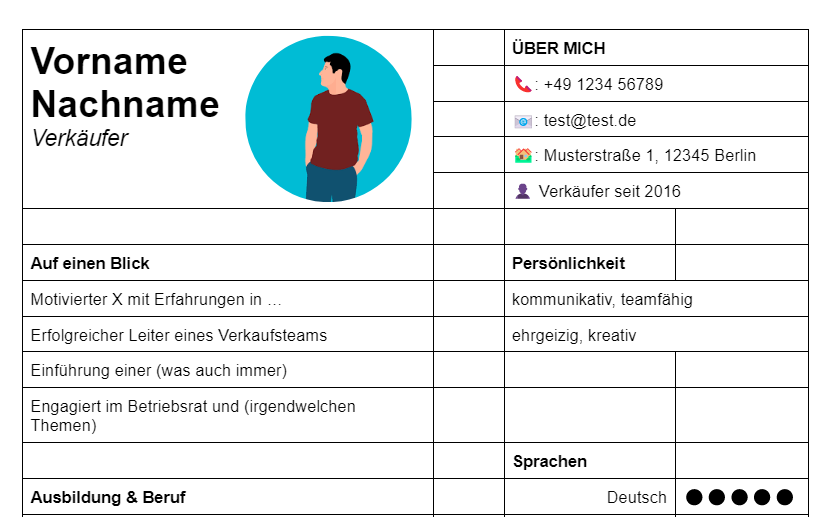
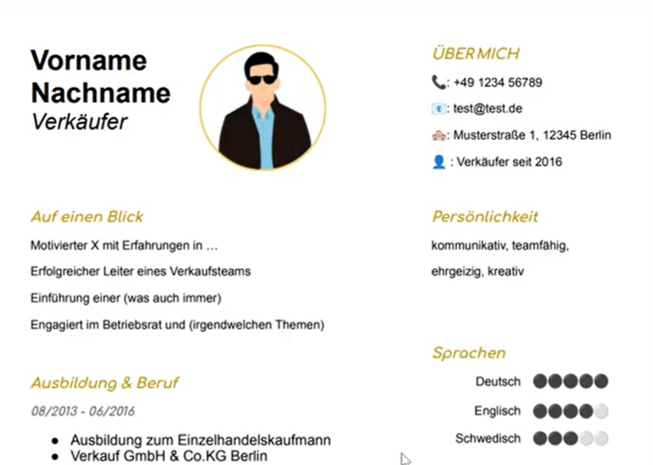

# Lebenslauf mit Google Docs erstellen (inkl. Vorlage)

Im heutigen [Video](https://www.youtube.com/watch?v=_2M7qo1hWug) geht es um das Erstellen eines Lebenslaufes in Google Docs. 

## Das Wichtigste in Kürze

* Anleitung zum Erstellen eines Lebenslaufes von einer leeren Seite bis zum fertigen Design und PDF Download
* [Vorlage](https://bit.ly/3OUJQ83) zum Herunterladen und selbst gestalten (inkl. Anleitung)
* Bewerbungsfoto in Docs bearbeiten und kreisförmig machen
* Verschiedene Vorschläge zum Design
* Sehr individuell anpassbares Layout und Design

## Wie erstellt man einen Lebenslauf in Google Docs?

Die größte Herausforderung ist es, die Freiheiten zu behalten das Layout und das Design möglichst einfach & schnell anzupassen, aber ohne das altbekannte Problem: Ich ändere eine Sache und alles verschiebt sich.

Die Lösung dieses Problems ist eine Tabelle. Diese stellt die Grundstruktur des Layouts dar und kann jederzeit angepasst werden. Durch das große Update (Hier gehts zum [Video](https://www.youtube.com/watch?v=Fm1NSxj8_Zk)) für Tabellen am Ende des letzten Jahres ist es sogar kein Problem ganze Spalten schnell & einfach zu verschieben. Somit kann selbst die Grundstruktur später immer noch ohne großen Aufwand verändert werden.

## Wie kommt man aber von einer Tabelle zu einem Lebenslauf?

Das Problem des Layouts haben wir mit der Tabelle gelöst. Allerdings sieht die Tabelle mit ihren ganzen Linien um die Zeilen und Spalten sehr hässlich aus. Die Magie dahinter ist es, die Farbe der Linien an die Hintergrundfarbe der Seite anzupassen. Ist die Seite weiß, werden die Rahmenlinien der Tabelle einfach weiß gefärbt. Schon ist die Tabelle nicht mehr sichtbar und der Lebenslauf zeigt sich von seiner besten Seite.

## Meine Vorlage selbst benutzen

Im Video zeige ich dir auch meine Vorlage und wie du diese benutzen kannst. Unter dem [Video](https://www.youtube.com/watch?v=Fm1NSxj8_Zk) findest einen Link zur [Vorlage](https://bit.ly/3OUJQ83). Die Vorlage umfasst das fertige Layout und die Tabelle. Kopiere diese einfach in dein eigenes Dokument. Beachte, dass du noch die Seitenränder deines Dokumentes verkleinern musst, damit alles auf eine Seite passt. Anschließend hast du das fertige Layout in deinem Dokument. Nun sind deine Kreativität und dein Leben gefragt. Fülle deinen Lebenslauf mit deinen Informationen und designe ihn nach deinen Vorlieben. Anschließend musst du die Rahmenlinien der Tabelle an deine Seitenfarbe anpassen. Und schon kannst du deinen Lebenslauf als PDF herunterladen und deine Bewerbung abschicken!

## Hintergrund zum Video

In einem Kommentar wurde ich gefragt, ob ich ein Tutorial über das Erstellen eines Lebenslaufes machen könnte. Diesem Wunsch konnte ich in unter einer Woche nachkommen. Außerdem wurde sich eine Schritt für Schritt Anleitung inkl. Template zum Downloaden gewünscht.

Bitte schreibt mir unbedingt, falls ihr euch tatsächlich mit meiner Lebenslauf Vorlage bewerbt und eventuell Erfolg damit habt!

## Fakten zum Tutorial

+ Zum [Video](https://www.youtube.com/watch?v=_2M7qo1hWug)
+ Arbeitsaufwand: ca. 10 Stunden
+ Zeit von der Idee bis zum Upload: 4 Tage
+ Länge: 42 Minuten
+ Thumbnail &#11015;

")